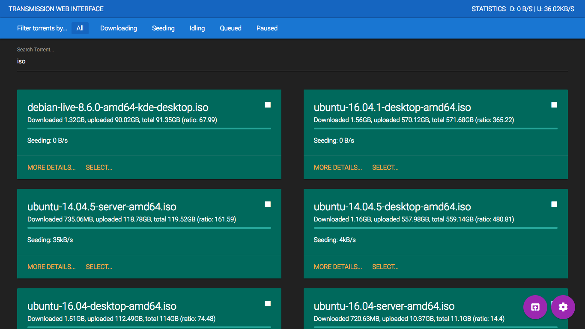

# Layered 2.0 (beta)
Complete rewrite of the Transmission Web Interface with Material Design,
using [jQuery](https://jquery.com), [MaterializeCSS](http://materializecss.com/) and [Unsemantic CSS Framework](http://unsemantic.com/).

Current version: _v2.0-beta1 - initial beta release_

## Screenshots
### Desktop


## Mobile Compatiblity?
Yes, this does not work right now, but you can use apps like [Transdrone](https://play.google.com/store/apps/details?id=org.transdroid.lite) for Android - it works pretty well.

## But, I don't have Transmission installed yet!
You can use the [AtoMiC ToolKit](https://github.com/htpcBeginner/AtoMiC-ToolKit), provided here, if you haven't gotten Transmission installed.

## Installation
You can use Layered instead of the original web client to remotely administrate your transmission application.

### Using Environment Variables
If you're just trying Layered out, it is recommended to set the TRANSMISSION_WEB_HOME environment variable to the root path of this web client. Then you just need to open the location to the transmission web server (e.g. localhost:9091) and it will work.

### Manual Installation
Move the Layered files in the right location, and the next time you start Transmission, it will use Layered. If you're using the daemon, you can simply send it a `SIGHUP`.

#### Linux
To use Layered, you may replace the contents of `/usr/share/transmission/web`.

```
cd /usr/share/transmission
rm -rf /usr/share/transmission/web
git clone https://github.com/theroyalstudent/layered.git web
```

#### Mac OS X
To use Layered, you may replace the contents of `/Applications/Transmission.app/Contents/Resources/web/`.

```
cd /Applications/Transmission.app/Contents/Resources
rm -rf /Applications/Transmission.app/Contents/Resources/web
git clone https://github.com/theroyalstudent/layered.git web
```

## Contributing
Feel free to make pull requests to the `develop` branch, and for any bugs, please do not hesitate to open an issue!

To install the dependencies used to build resources:

```
npm install
```

## Credits
* [@theroyalstudent](https://github.com/theroyalstudent) for the rewritten interface.

#### Libraries Used:
* [Bourbon](http://bourbon.io)
* [MaterializeCSS](http://materializecss.com)
* [Unsementic](http://unsemantic.com)

## Licenses

Copyright (C) 2014-2017 [Edwin A.](https://theroyalstudent.com) <edwin@theroyalstudent.com>

This work is licensed under the Creative Commons Attribution-ShareAlike 3.0

Unported License: http://creativecommons.org/licenses/by-sa/3.0/